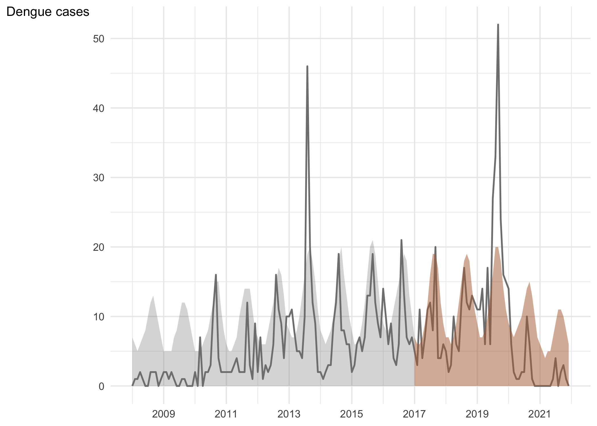

<!-- README.md is generated from README.Rmd. Please edit that file -->

# odes

This package implements an approach to forecasting count time series
with a form of exponential smoothing built from observation-driven
models of Davis, Dunsmuir and Streett (2003). The methodology is
discussed in Karlis, Pedeli and Varin (2023).

<!-- badges: start -->
<!-- badges: end -->

## Installation

You can install the development version of odes from
[GitHub](https://github.com/) with:

``` r
# install.packages("devtools")
devtools::install_github("crisvarin/odes", build_vignettes = TRUE)
```

## Example

This is a basic example showing how to use odes for disease
surveillance:

``` r
library(odes)
example(surveillance.odes)
#> 
#> srvll.> ## Replicates Section 4 of Karlis, Pedeli and Varin (2023)
#> srvll.> dengue_data <- data.frame(counts = dengue, time = seq_len(length(dengue)))
#> 
#> srvll.> dates <- seq(as.Date("2008/1/1"), by = "month", length.out =
#> srvll.+ nrow(dengue_data))
#> 
#> srvll.> rownames(dengue_data) <- dates
#> 
#> srvll.> ## phase I
#> srvll.> dengue_phaseI <- dengue_data[1:108, ]
#> 
#> srvll.> fit <- odes(counts ~ sin(2 * pi * time / 12) + cos(2 * pi * time / 12),
#> srvll.+ data = dengue_phaseI)
#> 
#> srvll.> summary(fit)
#> 
#> Call:
#> odes(formula = counts ~ sin(2 * pi * time/12) + cos(2 * pi * 
#>     time/12), data = dengue_phaseI)
#> 
#>                       Estimate Std. Error z value Pr(>|z|)    
#> (Intercept)            1.38553    0.13572  10.209   <2e-16 ***
#> sin(2 * pi * time/12) -0.73445    0.07253 -10.127   <2e-16 ***
#> cos(2 * pi * time/12) -0.07760    0.05777  -1.343    0.179    
#> ---
#> Signif. codes:  0 '***' 0.001 '**' 0.01 '*' 0.05 '.' 0.1 ' ' 1
#> 
#> Smoothing parameter (alpha): 0.08
#> srvll.> ## phase 2
#> srvll.> dengue_phaseII <- dengue_data[-(1:108), ]
#> 
#> srvll.> surv <- surveillance.odes(fit, new_data = dengue_phaseII, names_as_dates =
#> srvll.+ TRUE, date_labels = "%Y", breaks = "2 year", x_label = NULL, y_label =
#> srvll.+ "Dengue cases")
#> Warning: Use of `gg_df$times` is discouraged.
#> ℹ Use `times` instead.
#> Warning: Use of `gg_df$y` is discouraged.
#> ℹ Use `y` instead.
#> Warning: Use of `gg_df$times` is discouraged.
#> ℹ Use `times` instead.
#> Warning: Use of `gg_df$y` is discouraged.
#> ℹ Use `y` instead.
#> Warning: Use of `gg_df$times` is discouraged.
#> ℹ Use `times` instead.
#> Warning: Use of `gg_df$y` is discouraged.
#> ℹ Use `y` instead.
```



    #> 
    #> srvll.> surv$alarms
    #> 2017-03-01 2017-09-01 2018-04-01 2018-12-01 2019-01-01 2019-02-01 2019-03-01 
    #>          3          9         16         24         25         26         27 
    #> 2019-05-01 2019-07-01 2019-08-01 2019-09-01 2019-10-01 2019-11-01 2019-12-01 
    #>         29         31         32         33         34         35         36 
    #> 2020-01-01 
    #>         37

The package vignette expands on the previous example by allowing the
results discussed in Section 4 of Karlis, Pedeli, and Varin (2023) to be
fully replicated:

``` r
# To view the vignette type
# vignette("odes")
```

## References

Davis, R.A., Dunsmuir, W.T. & Streett, S.B. (2003). Observation-driven
models for Poisson counts. *Biometrika* **90**(4), 777–790.

Karlis, D., Pedeli, X. & Varin, C. (2023). Observation-driven
exponential smoothing. *Stat* **12**(1), e642.
